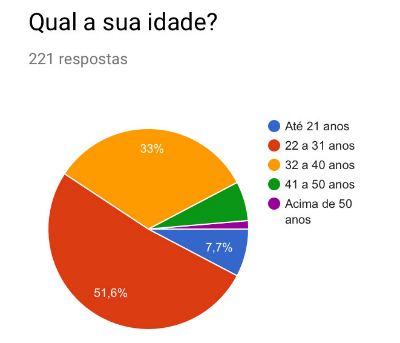
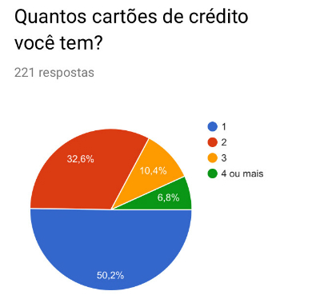
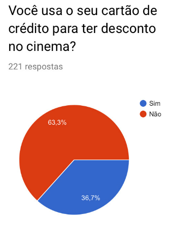
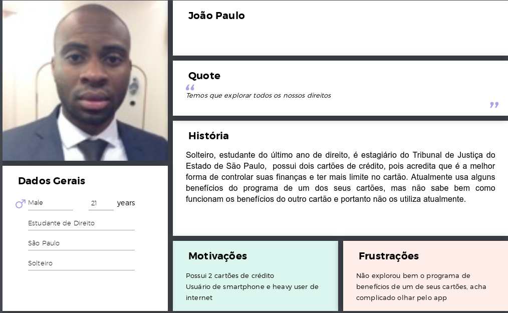

# Projeto API - Ben

## Definição do Produto
O Ben é um site/app para usuários de cartão de crédito fazerem uso dos respectivos programas de benefícios dos seus cartões. Muitos usuários de cartão hoje em dia tem mais de um cartão e não tem clareza sobre os benefícios que possuem direito. São diversas regras, diversas plataformas e vários benefícios excelentes. O objetivo do Ben é unificar as plataformas e trazer um lugar de fácil acesso à todas essas informações. 
No Ben, o usuário pode marcar todos os cartões de quaisquer bancos que ele tem e já ter acesso à lista de benefícios que ele possui em relação a todos eles. 

## Logo

## Necessidade do Produto
Os usuários desejam obter descontos, ter mais acesso a entretenimento e cultura, ter o comparativo entre os benefícios dos cartões e ter uma informação clara sobre como funcionam os programas de benefícios que ele possui direito. 

## Quem são os usuários?
Pessoas que utilizam cartão de crédito regularmente e acessam aplicativos em desktop e smartphones.

## Pesquisa com potenciais usuários 
O intuito desta pesquisa foi entender como os usúarios de cartão de crédito obtém informações e utilizam os programas de benefícios do cartão

### Pergunta 1

### Pergunta 2

### Pergunta 3

### Pergunta 4

### Pergunta 5

### Pergunta 5

### Pergunta 6

### Pergunta 7

### Pergunta 8

### Pergunta 9

## Personas
Essas são as personas desenvolvidas para o projeto Ben: 

## roadmap oficial do projeto

#### versão 1.0.0 (in progress)
- funcionalidades: possibilita cadastro, login, selecionar os tipos de cartão que o usuário possui.
- possibilita verificar descontos no cinema a partir de cartão que o usuário possui.

#### versão 2.0.0 (sem previsão)
- funcionalidades: permite buscar também ingressos para teatro e pré-venda com desconto para shows.

#### versão 3.0.0 (sem previsão)
- funcionalidades: permite verificar todas os benefícios de cada programa de cartão de crédito filtrado por centro de interesse (troca de pontos, descontos em ingressos, descontos em compras).